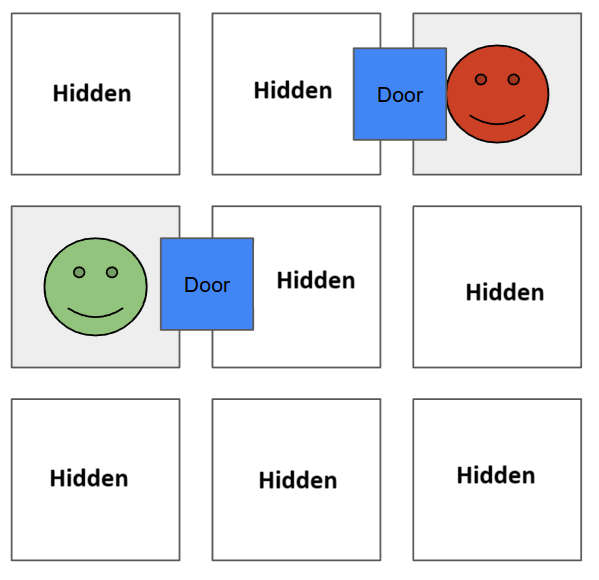

# Creating Private, Discoverable Worlds in Public Spaces using Zero Knowledge Cryptography


When exploring the real world, new discoveries are initially known only to the person who finds them. These findings are shared with others only if they independently discover the same thing or if the original explorer chooses to reveal the information.

In the digital world, the concept of discovery is often managed through centralized systems. For example, in multiplayer games, the world is often hidden behind a centralized server that controls what information is revealed to players, ensuring that discoveries are shared or made accessible only to those who actively explore. In single-player games, the world may be designed with parts of it hidden or made inaccessible through the user interface, only unlocking as players progress.

In a decentralized game, the world should not be controlled by any single entity. Blockchain technology makes this possible by providing a tamper-proof, transparent ledger without central authority. However, because blockchains are inherently public, they make the world visible to everyone, not just those exploring it. Cryptography solves this by ensuring that, while the world remains consistent for all, information is **only** revealed to those actively exploring it, preserving privacy and enabling genuine discovery.

## 1) Summary
This article explores how a private world can be created within a public space using blockchain and cryptographic techniques. The world remains hidden to **everyone** except those actively exploring it. Explorers navigate a dynamically generated 2D grid of rooms, where each room’s details are only revealed when discovered. Cryptographic commitments and Zero-Knowledge Proofs (ZKPs) ensure privacy, and explorers can query each other for information using [Private Set Intersection (PSI)](https://en.wikipedia.org/wiki/Private_set_intersection), without exposing which rooms are being asked about. 

## 2) Designing the World
Imagine a 2D grid of rooms forming the foundation of our world. Each room may have doors connecting it to adjacent rooms in the four cardinal directions:


Explorers navigate this world by moving a character through these rooms, entering new areas through doors. Initially, the world is completely unknown — no one knows which rooms are connected or even if all rooms are accessible. Importantly, the rooms are not pre-generated; instead, they come into existence only when an explorer discovers them. This ensures that no individual can design or pre-know the structure of the world, paralleling the way the real world lacks a single "builder" who knows everything about it.

## 3) The Process of Exploration

Let’s consider two explorers who have just entered the world:



Each explorer is only aware of the details of the room they are currently in. They know the directions of the doors within their room, but they have no knowledge of what lies in adjacent rooms — whether those rooms belong to other explorers or are uncharted. Similarly, other explorers or outside observers cannot see any rooms.

### Room Generation Mechanics

Now, imagine the green explorer decides to venture into an adjacent, unexplored room. As they enter, the new room is dynamically generated:


When a new room is generated, its features — such as which doors are open or closed—are determined randomly. For instance, in the image above, the random process created a room with one open door leading upwards, while the door to the left corresponds to the explorer's entry point.

To generate room we need to have an access to random oracle that gives us a random number. There's many options on how this oracle could be implemented, but that is not important, let's just imagine we have an access to an oracle that provides us with a random number and we can trust the number to be a number that was not known by anyone prior we get it. This number should be public for everyone.

1) **Room Seed Generation**

The explorer hashes the public random number with their private key to produce a room seed which is only known by the explorer:
```
room_seed[x,y] = hash(publicRandom, privateKey)
```

2) **Room Hash Commitment**

The room seed is used to calculate the room's layout (e.g., door positions). To prevent tampering, the explorer commits the hash of this seed to the blockchain along with the public random number that was used:
```
room_hash[x,y] = hash(room_seed[x,y])
room_random_number[x,y] = publicRandom
```

This cryptographic process ensures that the explorer cannot retroactively alter the room's properties. If an explorer attempts to manipulate results — such as by discarding undesirable outcomes — this misbehavior can be detected and punished (e.g., by killing their character or slashing their stake). Since the fault is provable, penalties can be enforced in a trustless manner.

### Generating a Room Next to an Already Generated Room

#### Problem: Room Dependencies
When the red explorer moves left next to the green explorer, they must generate a new room. However, this new room depends on the state of the already-generated room below. For example, if the lower room has an upward door, the new room must have a downward door.


While the red explorer knows the room below exists (public information), they lack details about its door configuration. This information is private to the green explorer.

#### Solution: Sharing Information with Zero-Knowledge Proofs
The red explorer requests the specific information about whether a door exists between the rooms. The green explorer communicates the variable $hasDoorUpwards[x, y]$, which indicates if there's a door upwards in the room below, along with a zero-knowledge proof (ZKP) that ensures the information is valid. The ZKP must prove that:

```circuit
roomHash[x,y] = hash(roomSeed[x,y]) and
hasDoorUpwards(roomSeed[x,y]) = has_door_upwards[x,y]
```

To preserve privacy, the green explorer encrypts the information using the red explorer's public key and shares it publicly on chain. While off-chain sharing suffices in the ideal case, an on-chain mechanism is necessary to handle disputes.

#### Handling Misbehavior
1) **Refusal to Share**: If the green explorer refuses to share the required information, the red explorer can slash the green explorer for bad behavior using the on-chain protocol.

2) **Providing Invalid Information**: If the red explorer cannot decrypt the shared data or if the decrypted message does not include valid information about the room's doors, they can provide a proof of failure:
```circuit
decrypt(message) != (room_hash[x,y], proof)
```

The red explorer can then generate the room as before and set door between the rooms open using the green explorers information.

#### Edge Cases
1) **Fully Generated Rooms**: If the room is already generated, the red explorer requests the full $roomSeed[x, y]$. This enables them to validate the room and generate proofs for other explorers if needed.
2) **Multiple Nearby Rooms**: When multiple neighboring rooms are already generated, the red explorer must query the respective explorers using the same protocol to gather all required information.

## 4) Hidden movement
Currently, explorers' locations are fully visible, which is unrealistic. A new protocol is required to enable private movement while maintaining the ability to share world information appropriately.

We need a significant overhaul of the protocol to enable private movement for explorers while preserving the mechanics of world exploration. Explorers must be able to navigate the world without revealing their positions and share relevant information about the world only when necessary.

A blog post, [zk-hunt](https://0xparc.org/blog/zk-hunt) by [Flynn Calcutt](https://twitter.com/FlynnCalcutt) offers a great explanation of private movement in games. We’ll be implementing a similar system in our own world. While we won’t go into the specifics of the implementation, our focus will be on creating a hidden world.

Flynn also introduces a concept of a hidden world involving a trusted **world creator** who designs the world and shares it with players. However, we aim for a decentralized approach where the world is hidden to **everyone except the explorers** and those they choose to share information with.

When explorers move through the hidden world, a challenge arises when encountering new rooms. Explorers need to determine:

1) Whether a room already exists.
2) Which other explorers, if any, possess information about that room or its surroundings.

To achieve this:

1) **Query Mechanism**: Explorers must query others about a room's status without revealing the room in question.
2) **Selective Responses**: Responding explorers must provide accurate information about the queried room without disclosing details about other rooms.
This protocol must ensure privacy for both the querying and responding explorers, requiring a fundamentally different approach from existing methods.

Problem description:
> - We have an user A that wants to know information about one specific room
> - We have user group B with information about the rooms
> - The user A wants to query the group B about the information about one room, without sharing any information on what the room is in question
> - The user group B only want to share information about the one particular unknown room, and nothing about the others

### Private Set Intersection
The challenge described aligns with a well-known problem: [Private Set Intersection (PSI)](https://en.wikipedia.org/wiki/Private_set_intersection).
PSI enables two parties to compare their data sets and determine their intersection while revealing nothing beyond the result.

For instance:
1) Explorer 1 wants information about Room A, represented as $𝑠𝑒𝑡_1=[𝐴]$
2) Explorer 2 knows about multiple rooms, represented as $𝑠𝑒𝑡_2=[𝐴,𝐶,𝐷,𝐸]$
3) Using PSI, Explorer 1 can learn that Room A is in Explorer 2's set, without disclosing to Explorer 2 which room was queried.

There's multiple protocols than can achieve PSI, I believe the simplest such protocol is [Diffie-Hellman based PSI](https://blog.openmined.org/private-set-intersection-with-diffie-hellman/). Diffie-Hellman based PSI can be found implemented in [ZheroTag](https://github.com/kilyig/ZheroTag/tree/main) game by [kilyig](https://github.com/kilyig). ZheroTag implements cryptographical Fog of War (FoW) with DH-PSI protocol. It also incorporates zero-knowledge circuits to ensure participants cannot cheat.

While Diffie-Hellman-based PSI can function without zero-knowledge proofs, doing so requires assuming honest participants, which might not be practical in all scenarios.

Although our problem is similar to the Fog of War scenario, there is a key difference: In our case, the world itself is obscured (Fog of War applies to the world structure), whereas in traditional FoW, only the players' movements and visibility are concealed.

### Using the PSI protocol
To effectively utilize the Private Set Intersection (PSI) protocol, we first need to determine the sets to compare. At first glance, it might seem logical to compare the coordinates of the current room with other explorers' known room coordinates, but this approach is insufficient. Instead, we need to compare the smallest unit of information available: pathways between rooms.

A room consists of four doors, each of which can be open or closed. To maintain privacy and completeness, we cannot first query the existence of doors and then separately inquire about their states (open or closed). Therefore, we must query all possible combinations of door states in the room simultaneously. For example, to query the full state of a room at $(x = 5, y = 5)$ we would request the following:

```
1) x = 5, y = 5, doorUp = open
2) x = 5, y = 5, doorUp = closed
3) x = 5, y = 5, doorLeft = open
4) x = 5, y = 5, doorLeft = closed
5) x = 5, y = 5, doorDown = open
6) x = 5, y = 5, doorDown = closed
7) x = 5, y = 5, doorRight = open
8) x = 5, y = 5, doorRight = closed
```

Each explorer needs to respond with information about the states of the doors for all the rooms they know, providing up to four data points per room.

#### Optimizing Data Representation
To reduce the amount of data exchanged, we can eliminate redundancy in door states. Adjacent rooms inherently contain information about each other's doors. For instance:

- If a room on the right has a left door, the room on the left must have a corresponding right door.

Thus, a room can be uniquely represented using only the following variables: $X$, $Y$, $doorUp$, $doorLeft$, no need to have variables $doorDown$, $doorRight$ as these are stored in the nearby room already. This means we can modify our query to be:
```
1) x = 5, y = 5, doorUp = open
2) x = 5, y = 5, doorUp = closed
3) x = 5, y = 5, doorLeft = open
4) x = 5, y = 5, doorLeft = closed
5) x = 5, y = 6, doorUp = open
6) x = 5, y = 6, doorUp = closed
7) x = 6, y = 5, doorLeft = open
8) x = 6, y = 5, doorLeft = closed
```

With this optimized query structure, explorers only need to respond with unique door data, avoiding duplication.

#### Handling Information Privacy
When an explorer moves to a new room, they query other explorers using PSI to gather information about the room's state. However, this process still reveals certain pieces of information that we might prefer to keep private:

1) If a door match is found, the querying explorer learns that the responder has visited the room.
2) If no match is found, the querying explorer deduces that the responder has not visited the room.
3) The querying explorer also discovers whether they are the first to explore the room.

In the current protocol, this leakage is unavoidable since discovering whether a room or its neighbors are unexplored is critical for generating new rooms.

### Hiding information on who has been in the location
We can enhance the PSI protocol by aggregating all queries and responses from participating explorers into a single, unified process. This ensures that the querying explorer cannot deduce which specific explorer provided the information. To achieve this, we need a communication protocol that obscures the identity of the responder while maintaining the integrity of the data exchange.

#### Using a Relay Service for Anonymity
One way to implement this is by introducing a relay service. Explorers send their information to the relay, which then forwards it to the querier. The relay acts as a neutral intermediary, preventing the querier from knowing the identity of the responder. To further reinforce anonymity:

- The relay service can be any trusted or semi-trusted party capable of keeping communication origins private.
Alternatively, explorers can use anonymity-preserving protocols like - TOR to interact with the relay, minimizing trust requirements.
This approach ensures that the querier only receives aggregated responses, eliminating direct links between responses and individual explorers.

#### Mitigating Timing and Order Leaks
Despite using a relay service, timing or order of responses may still leak some information. For instance:

If responses arrive sequentially, the querier might deduce how many explorers participated or infer patterns based on response order.
To address this:

1) **Batching Responses**: The relay can aggregate all responses and send them to the querier in a single batch, masking individual participants.
2) **Randomized Delivery**: The relay could distribute responses over time in a random order, further obscuring their origins.

#### Challenges with Relay-Based Systems
While these techniques enhance privacy, they introduce additional complexity and potential issues:

1) **Reliability**: Messages could be lost or delayed, particularly with randomized delivery or over noisy networks.
2) **Protocol Complexity**: PSI protocols typically require multiple back-and-forth exchanges, and adding a relay increases the overhead.

#### Residual Information Leakage
Even with these measures, some information leakage is unavoidable. For example:

- The querier can infer how many explorers have encountered a particular door based on the number of matches found in the PSI results.

Although this information leakage is minimal compared to direct interactions, further advancements in privacy-preserving techniques or alternative PSI protocols may be required to fully mitigate this issue.

### Concealing the count of explorers traces
Improving the protocol to fully obscure whether explorers have visited a location while still allowing the room to be deterministically generated from valid inputs presents a unique challenge. Specifically, some explorers may know the correct state of a room, while others may not. The task is to combine their inputs without revealing who possesses accurate information — or even whether any such information exists.

#### Problem Statement
The requirements for the protocol are as follows:

- **Input Handling**: Some explorers possess correct information about the room's state, while others do not.
- **Output Generation**: The protocol must:
    1) Accurately generate the room if valid information exists.
    2) Produce random a room if no valid information is provided.
    3) Ensure the querier cannot determine whether the room is accurate or random.

**Anonymity**: The protocol must not reveal which explorers, if any, contributed valid information.

#### Challenges
The primary difficulty lies in ensuring that the process is entirely anonymous. Explorers who know the correct state of a room must contribute their inputs in a way that cannot be distinguished from those who do not. This prevents the querier from inferring the presence or absence of knowledgeable explorers based on the result of the protocol.

If a solution to this challenge exists, it could enable the room to be reliably generated without any information leakage about prior explorer activity. However, as of now, finding such a solution remains an open problem.

The problem statement for this protocol is as follows:
> - There's multiple people with real information about the variable
> - There's multiple people with no information about the variable
> - How to combine this information in a way that I can get the value of the variable if it exists, and garbage otherwise? And I do not know if I have gotten the right value, or just garbage.

I believe there's a protocol that can accomplish this, but I wasn't able to come up with one for now. If there's a no solution for this problem, one can design a game around this mechanic.

#### Game Design Implications
If it is impossible to create such a protocol, the mechanic can still be integrated into the game design. For instance, footprints or residual traces could indicate the presence of other explorers without revealing their identities. This feature could enhance the narrative while introducing strategic gameplay elements, such as tracking others' movements or identifying unexplored areas.

## 5) Explanding the World and Rules
1) **Player Visibility**: Currently, players cannot see each other. This can be easily changed by including character location data in their communications. Location sharing would follow the same mechanism as door-sharing within the protocol.

2) **Enhanced Room Features**: The world can extend beyond just doors. Additional variables could represent unique room features or items. However, the PSI protocol is already computationally intensive, and adding more variables would further increase its complexity.

3) **Hierarchical World Structure**: The world could include a hierarchical structure for broader exploration. For instance, biomes consisting of clusters of four rooms could be introduced. A separate PSI protocol could manage biome-level information, with biome attributes influencing the generation of individual rooms within them.

4) **Dynamic Memory and World Evolution**: As the game progresses, explorers’ door histories grow continuously. To manage this, explorers could gradually forget old information, allowing the dungeon to evolve dynamically as forgotten areas change over time.

## 6) Challenges
1) **Continuous Communication**: Explorers must communicate with each other regularly, as relying solely on blockchain is insufficient. Additionally, the PSI protocol requires multiple communication rounds, further increasing complexity.

2) **Inefficiency of PSI**: PSI is not an efficient protocol, and the amount of data exchanged between users can be substantial, adding to resource demands.

3) **Simultaneous Participation**: Creating a world where anyone can join and explore at any time is impractical. All explorers must be online simultaneously and ready to respond when others take actions, limiting flexibility.

4) **Growing Room History**: Explorers’ room history lists grow continuously as the game progresses. To manage this, explorers could gradually forget older information, allowing the world to evolve and change dynamically as forgotten areas are rediscovered.


Thanks for [Ronan](https://x.com/wighawag) for this hackathon idea. The writing is also inspired by [Autonomous World Discovery Devcon Bogota talk](https://www.youtube.com/watch?v=cWrSpTMpx4E&t=6027s) by [Flynn Calcutt](https://twitter.com/FlynnCalcutt).